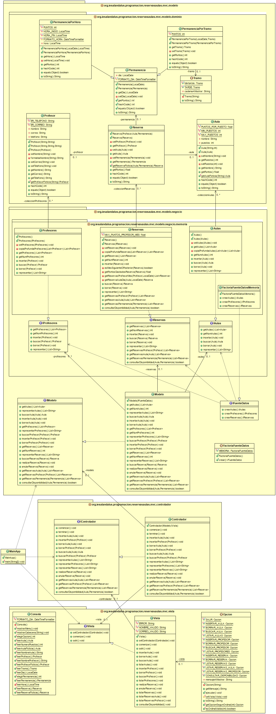

# Tarea Reservas de Aulas
## Profesor: Andrés Rubio del Río
## Alumno: Raúl Herrerias Corral

Desde el IES Al-Ándalus nos acaban de comentar que por favor añadamos persistencia a los datos introducidos, ya que tal y como está ahora la aplicación no es funcional. Por tanto, en este cuarto spring añadiremos persistencia a los datos utilizando para ello ficheros de objetos, para lo que sustituiremos el modelo que teníamos de memoria, por un modelo de ficheros.

El diagrama de clases queda como te muestro a continuación y poco a poco te iré explicando los diferentes pasos a realizar:

Por tanto, tu tarea va a consistir en completar los siguientes apartados:

1. Crea un nuevo repositorio remoto en github y llámalo reservasAulas-v3.
2. Actualiza el fichero `README.md` en tu proyecto Eclipse utilizando el que puedes descargar del enlace proporcionado por el profesor y añade tu nombre en el apartado "Alumno". Realiza un commit.
3. Haz que las clases de dominio (para las que sea necesario) sean serializables para que se puedan leer y escribir de ficheros de objetos. Realiza un commit.
4. Implementa los métodos de lectura y escritura para la clase `Aulas`. Realiza un commit.
5. Implementa los métodos de lectura y escritura para la clase `Profesores`. Realiza un commit.
5. Implementa los métodos de lectura y escritura para la clase `Reservas`. Realiza un commit.
6. Haz que estos métodos sean accesibles desde el controlador, por lo que deberás modificar la clase `Modelo` y la interfaz `IModelo`. Realiza un commit.
7. Actualiza la clase `FactoriaFuenteDatos` para que contemple la opción de ficheros. Realiza un commit.
8. Haz las modificaciones oportunas en la clase `Controlador` para que al comenzar se leen los diferentes ficheros y al salir se escriban los mismos. Realiza un commit y súbelo a tu nuevo repositorio remoto.

###### Se valorará:
- La nomenclatura del repositorio de GitHub y del archivo entregado sigue las indicaciones de entrega.
- La indentación debe ser correcta en cada uno de los apartados.
- El nombre de las variables debe ser adecuado.
- Se debe utilizar la clase `Entrada` para realizar la entrada por teclado.
- El proyecto debe pasar todas las pruebas que van en el esqueleto del mismo y toda entrada del programa será validada para evitar que el programa termine abruptamente debido a una excepción.
- Se deben utilizar los comentarios adecuados.
- Se valorará la corrección ortográfica tanto en los comentarios como en los mensajes que se muestren al usuario.